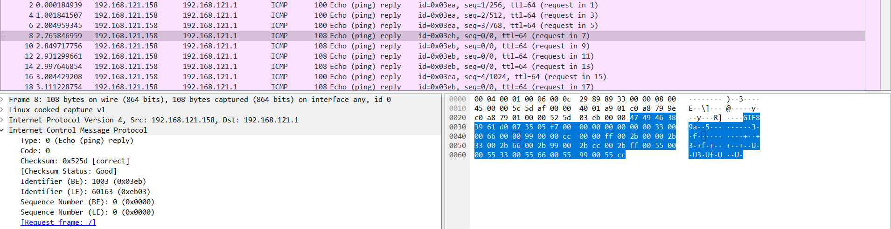

# ICMP

## Description
We found that some important data was exfiltrated from the PC. Can you help us finding what is the exfiltrated data?

### Flag:

For this chall let's start by analysing the packet first. If we look at the data of ICMP we can see it's a gif file...so let's just extract it and dump it in a gif file

And we have our flag

 