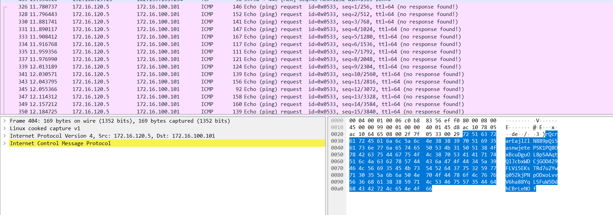

# Knock Knock

## Description

My friend some how managed to open a closed port but he refused to say the process but i have the network capture of the process can you help me out in finding the process?

Flag Format: flag{Something_here!!!!}

### Flag:

Alright so a pretty easy and basic chall...so as we can see in the file the ICMP packet lengths are not constant and they differ a lot and are random and not constant

So let's extract the length of these data.....They do look like ascii Oordinates....we let's see ....okay there we go we get the flag

flag{ICMP_p0rt_kn0cking_is_highly_s3cur3}

Script attached