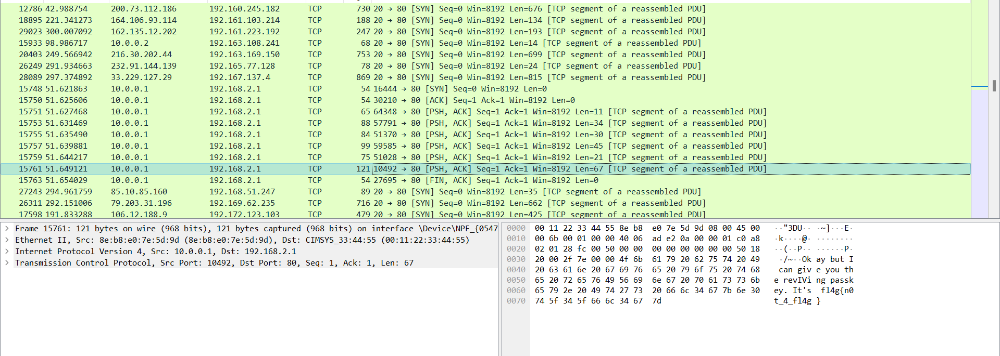
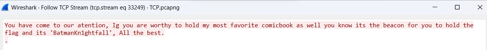
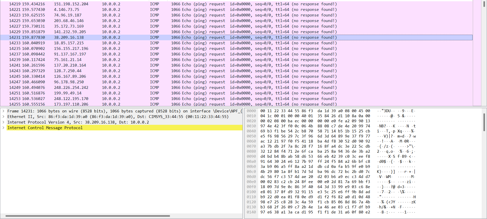

# Randomized Modular Kitchen

## Description

focus on the differences rather than focussing on Women!
You can find patterns but not all of them are patterns
It's easy af if you just look at changes

@author - Azr43lKn1ght

### Flag Extraction:

So for this chall we have been given a pcapng dump where we can find ICMP,TCP,DNS,STMP protocol which are commonly used for transferring data....so to start with the chall let's export the protocol specified packets to get analyse the best out of them.


After extracting we can find in the tcp file there is particular section with a lot of info getting transferred to the same destination after checking them out we find some weird data



Looks like it's will be useful for getting the final flag...now let's take a look at the stmp protocol of the file....there we find a mail which has an abnormal size of 187 bytes opening that we find another weird text



Looks like it's the iv for an encryption so we can say that the last one was a key..ok so now to find the cipher text

Let's take a look into the icmp protocol....we can see that a lot of random info was sent to dst 10.0.0.2 ....let's extract it and try to decrypt it



so to extract it i used this code :

```
from scapy.all import *
f = rdpcap("/mnt/c/Users/barsh/Downloads/Bi0s/updatedchall/ICMP.pcapng")
b= bytes()
for i in f:
    if ICMP in i and IP in i :
        if i[IP].dst == "10.0.0.2":
                b+=bytes(i[IP].load)
print(b)
open("flag.bin","wb").write(b)
```

After extracting i decrypted it with this and stored it in a file

```
from Crypto.Cipher import AES
with open("/mnt/c/Users/barsh/Downloads/Bi0s/flag.bin",'rb') as file:
    data = file.read()
key = b'BatmanKn1ghtfall'
iv = b'fl4g{n0t_4_fl4g}' 

def decrypt(data,key,iv):
    cipher = AES.new(key, AES.MODE_CBC, iv)
    decrypted = cipher.decrypt(data)
    return decrypted

print(decrypt(data, key, iv))
open("/mnt/c/Users/barsh/Downloads/Bi0s/updatedchall/flag.png","wb").write(decrypt(data,key,iv))
```

there we go it's a png file and we get the flag :


Challenge file and scripts attached :)


